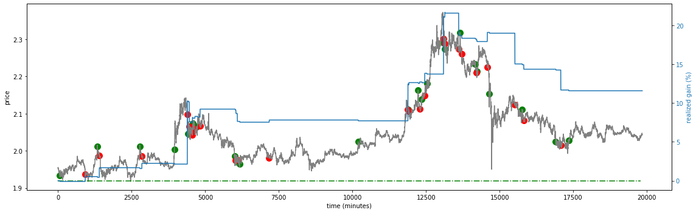

# t-bot

A quick attempt to trade with Reinforcement Learning 
Using Q-learning for training with a personalized reward scheme.
See: https://keras.io/examples/rl/deep_q_network_breakout/

# Scripts
- `learn.py`: used to build a model from provided data.
- `evaluate.py`: trade on the provided data and return a plot.
- `find_best.py`: trade on the provided data using all trained models and find the best one.

# Bets model so far
- `t-bot_112.h5`: trained on 14 days of ADA data using only the bet_USD column. It achieves 12% gain with 50% sampled selling and 9% without sampling.

# Data
The provided data is sampled with a 1 minute resolution.

# Parameters
The various constants set in the learn script can be cahnged and are based on experimenting with the data. Currently, the used ones are the best performing.

# Charts
